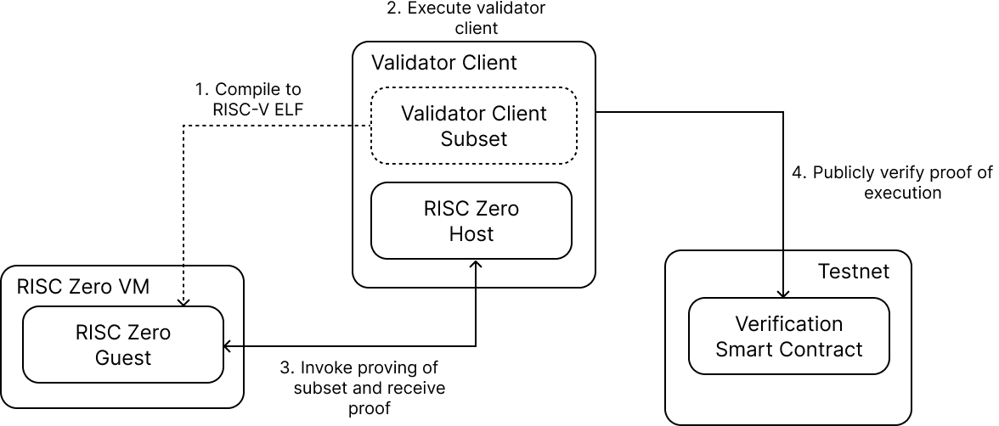

# Verifiable Client Diversity

We would like to share our project motivating [client diversity](https://ethereum.org/en/developers/docs/nodes-and-clients/client-diversity/) through economic incentives and verifiable execution techniques supported by Ethereum academic funding.

The basic idea of our project is to encourage the operator to deploy the minority client (less than 1/3rd of the network) with economic incentives and guarantee the authenticity of deployment results through trusted execution technology (e.g. TEE or ZKVM).

In this document, we provide the technical details of our first prototype implementation. You can find more about vision and motivation in our whitepaper: [https://arxiv.org/abs/2411.18401](https://arxiv.org/abs/2411.18401) .

# Prototype 0

This artcle will outline the goals and methods of a prototype implementation for a **Client Implementation Proof of Execution using a zkVM**. Here is a summary of the key points:

1.Objective.
* The provided excerpt from the document outlines the goals and methods of a prototype implementation for a **Client Implementation Proof of Execution using a zkVM**. Here is a summary of the key points:

1. **Objective**: 
   - Create a proof of execution for a client implementation using a zkVM.
   - Provide a proof of concept for proving and verifying the execution of a subset of a single client implementation.

2. **Proving**:
   - Utilize a zero knowledge execution environment to execute and produce a proof of execution for an arbitrary subset of the client implementation.

3. **Verification**:
   - Use existing verification mechanisms for the zero knowledge execution environment.

4. **Implementation**:
   - Implement the functionality in a local testnet to address implementation challenges and measure proving times and validation feasibility.

This prototype aims to demonstrate the feasibility of using zero knowledge proofs to verify the execution of client implementations in a secure and efficient manner.

### Implementation

We implemented the prototype using the Rust consensus client [Lighthouse](https://github.com/sigp/lighthouse) and the ZKVM [RISC-Zero](https://risczero.com/) to produce proofs of execution.

Figure 1: Overview of Prototype 0

Figure 1 shows an overview of Prototype 0. It consists of 3 main components:

1. A modified [Lighthouse validator client](https://github.com/ASSERT-KTH/lighthouse).
2. A [RISC-V ELF of the lighthouse's subset implementation (e.g., BLS signature)](https://github.com/ASSERT-KTH/lighthouse/blob/risc0-test/methods/guest/src/main.rs) (supranational/blst).
3. A [local testnet with the RISC Zero Groth-16 verifier contract](https://github.com/ASSERT-KTH/lighthouse/blob/risc0-test/network-params.yaml).

The process is executed as follows:

1. Before any execution, the RISC-V ELF is created from the current BLST dependency version.
2. The validator client is executed, with at least one validator key loaded.
3. At block proposal time, the validator client performs its duties as it would normally do. However it wil[l concurrently start a process to re-compute the BLS](https://github.com/ASSERT-KTH/lighthouse/blob/4b8f5e322d1a4f4a87748861d06f6d12cc14f3c1/validator_client/signing_method/src/lib.rs#L186) signature of the proposed block: this is the computation that produces a proof of execution.
4. The proof is sent in a transaction to the verifier smart contract, and publicly validated.

This process is repeated for every block that the validator is assigned to produce.

The prototype is available at: [https://github.com/assert-kth/lighthouse](https://github.com/assert-kth/lighthouse). Instructions in how to run are included in the [`README.md`](http://README.md) file.

## Observations and Future Work

**Observation 1**

In our system, the observed proving time of BLS signature was ~1 hour. This long proving time forcefully requires that proving is performed as a parallel and asynchronous process. This means that the actual signature that is performed by the validator client (and included in the block) is not the one that proof is provided for. If the client operator is honest, the proof will mirror the original signature computation; but if it’s not, then the proof can easily be spoofed.

To tackle this limitation, the proving time has to be much shorter, so that the signature and proof are provided at the same time; ideally within the same block time.

We plan to experiment with:

1. Other program sub-sets of validator clients, which could potentially be able to be proved faster.
2. GPU acceleration.
3. Program-specific circuits (e.g. https://github.com/sp1-patches/bls12_381)

Furthermore, we plan to experiment with with other execution attestation mechanism instead, such as execution the program sub-sets signature in a TEE.

**Observation 2**

Currently, the ELF is created only from library code, which means that the proof is not linked to any specific client implementation. 

To tackle this issue, the code that wraps the library should be used in the proof as well. The more client code is included, the stronger the guarantee of a specific client being used. This however, has the downside of introducing even longer proving times.
